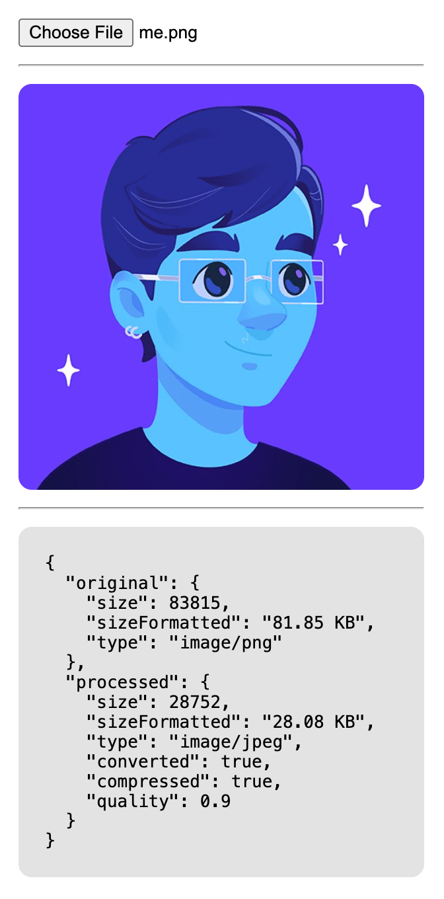

# 🖼️ JPEGR

A browser module to take **all image formats** supported by `HTMLCanvasElement` and convert them to **JPEG** with **size-targeted compression** to meet a configurable maximum output size.

- 🎮 [**JPEGR Playground**](https://wellwelwel.github.io/jpegr/)

---

<details>
<summary>
 <b>Table of contents</b>
</summary>

- [Key features](#key-features)
- [Installation](#installation)
- [Quick start](#quick-start)
- [API reference](#api-reference)
  - [Constructor](#constructor)
  - [Methods](#methods)
  - [Types](#types)
- [Examples](#examples)
- [Troubleshooting](#troubleshooting)
  - [Browser support](#browser-support)
  - [Debugging](#debugging)
- [Security notes](#security-notes)
- [License](#license)

</details>

---

## Key features

- Auto preview and easy upload to backend endpoints.
- Comprehensive fallback support for legacy and _lite_ browsers.
- Automatic compression starting from a chosen initial quality with granular steps.
- Allows using the original image when both format and size are within expectations.
- Normalizes **EXIF** orientation for **JPEG** inputs _(common "bug" in smartphone photos)_.

---

## Installation

```sh
npm i jpegr
```

---

## Quick start

```ts
import { JPGER } from 'jpegr';

const preview = document.querySelector<HTMLImageElement>('#preview');
const input = document.querySelector<HTMLInputElement>('#file');
const button = document.querySelector<HTMLButtonElement>('#upload');

const jpegr = new JPGER({ preview });

input?.addEventListener('change', () => {
  jpegr.process(input); // It will automatically show preview ✨
});

button?.addEventListener('click', () => {
  if (!jpegr.status.hasImage || jpegr.status.error) {
    alert('Upload a valid image to proceed.');
    return;
  }

  jpegr.upload('/api/upload'); // That's it ⭐️
});
```

- See the [**Examples section**](#examples) for **React** and real-world usage approaches and the [**Overview section**](#overview) for visual example.
- See the [**./examples**](./examples) directory for complete and functional working examples.

---

## API reference

### Constructor

#### `new JPGER(options?: JPGEROptions)`

Creates a new processor instance with its own internal cache and configuration defaults.

```ts
import { JPGER } from 'jpegr';

const jpegr = new JPGER({
  preview: null, // Specify an image element to preview the processed image.
  maxSize: 1 * 1024 * 1024,
  minQuality: 0.1,
  maxQuality: 1,
  compressionStep: 0.1,
  forceCompression: false,
});
```

- The example above uses all the default options.

---

### Methods

#### `process`

Processes an `HTMLInputElement` _(`<input type="file">`)_ or an image `File | Blob`.

```ts
const result = await jpegr.process(inputElement);
```

#### `upload`

Uploads the cached processed image to a backend URL as multipart form data.

```ts
const response = await jpegr.upload('/api/upload');
```

**Options:**

- `field` (default: `"image"`)
- `name` (default: `"image.jpeg"`)
- `init` (optional `RequestInit` merged into the fetch options)

```ts
const response = await jpegr.upload('/api/upload', {
  field: 'image',
  name: 'image.jpeg',
  init: {
    headers: {
      // ...
    },
  },
});
```

#### `clear`

Clears the stored processed image from memory.

```ts
jpegr.clear();
```

---

## Examples

### Vanilla JS 🍦

> → [**See the functional example**](./examples/vanilla-js/).

```html
<input id="file" type="file" accept="image/*" />

<script type="module" src="./main.mjs"></script>
```

```ts
import { JPGER } from 'https://cdn.jsdelivr.net/npm/jpegr@latest/lib/index.mjs';

const input = document.querySelector('#file');
const preview = document.querySelector('#preview');
const jpegr = new JPGER({ preview });

input.addEventListener('change', async () => {
  const result = await jpegr.process(input);

  if (!result.success) {
    console.error(result.error);
    jpegr.clear();
  }
});
```

### React ⚛️

> → [**See the functional example**](./examples/vite/).

```tsx
import type { ProcessResult } from 'jpegr';
import type { ChangeEvent } from 'react';
import { JPGER } from 'jpegr';
import { useRef, useState } from 'react';

export default () => {
  const { current: jpegr } = useRef(new JPGER());
  const [result, setResult] = useState<ProcessResult | null>(null);

  const onChange = (event: ChangeEvent<HTMLInputElement>) => {
    jpegr.process(event.currentTarget).then((data) => {
      if (!data.success) jpegr.clear();
      setResult(data);
    });
  };

  return (
    <>
      <input type='file' accept='image/*' onChange={onChange} />
      {result?.image && (
        
      )}
    </>
  );
};
```

#### Overview



- Check this example in [**./examples/vite**](./examples/vite/).

---

## Troubleshooting

### Browser support

**JPEGR** uses the following browser APIs:

- `HTMLCanvasElement`
- `Blob` → falls back to `File`
- `Uint8Array` → falls back to `DataView`
- `createImageBitmap` and `URL.createObjectURL` → falls back to `FileReader` → falls back to `Response` API

> [!TIP]
>
> If critical features are unavailable, you can use the static method `JPGER.canProcess()` to check for **JPEGR** support before attempting image processing, for example:
>
> ```ts
> import { JPGER } from 'jpegr';
>
> if (!JPGER.canProcess()) {
>   // ...
> }
> ```

### Debugging

Check feature availability in browsers:

```ts
import { JPGER } from 'jpegr';

const support = JPGER.getRuntimeSupport();
/**
 * {
 *   FileReader: true,
 *   Blob: true,
 *   File: true,
 *   HTMLCanvasElement: true,
 *   canvasToBlob: true,
 *   createObjectURL: true,
 *   createImageBitmap: true,
 *   Response: true,
 *   Uint8Array: true,
 *   DataView: true
 * }
 */
```

---

## Security notes

- This module runs entirely on the client side and does not upload anything unless you call `upload()`.
- Treat user-provided images as untrusted input. While browser image decoders are hardened, you should still validate server-side uploads.

---

## License

**JPEGR** is under the [**MIT License**](https://github.com/wellwelwel/jpegr/blob/main/LICENSE).<br />
Copyright © 2025-present [**Weslley Araújo**](https://github.com/wellwelwel) and **JPEGR** [**contributors**](https://github.com/wellwelwel/jpegr/graphs/contributors).
